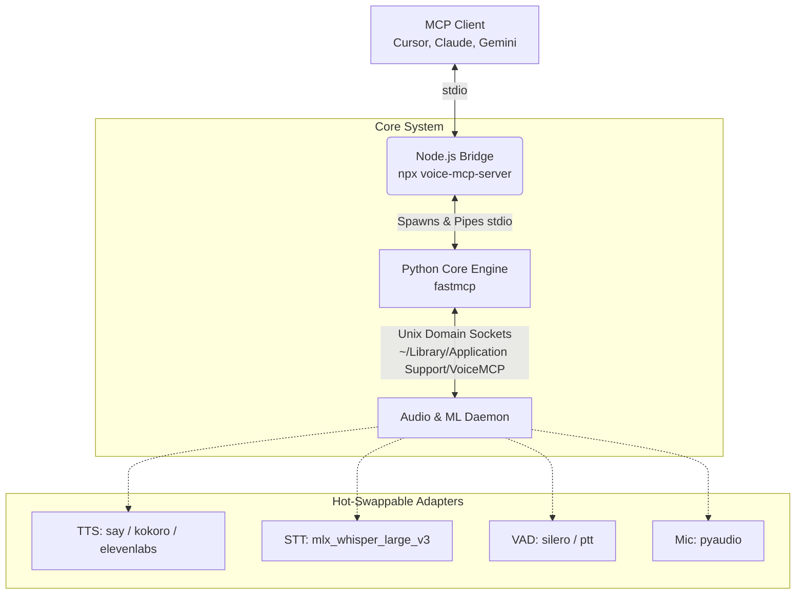

<div align="center">

# 🎙️ Voice MCP Server

**Give your AI agents a voice, real ears, and the ability to handle interruptions in real-time.**

[](https://www.npmjs.com/package/voice-mcp-server)
[](#-target-environment)
[](https://python.org)
[](https://modelcontextprotocol.io/)

</div>

---

## 💡 The Pitch

Typical AI assistants generate passive blocks of text. **Voice MCP Server** changes the paradigm by granting [Model Context Protocol (MCP)](https://modelcontextprotocol.io/) compatible agents (like Gemini, Claude, or Cursor) the ability to actively **speak and listen in real-time**.

Instead of a standard text response, the AI can initiate a **bidirectional voice loop** with you. Featuring blazing-fast local transcription and true human-like **barge-in (interruption) detection**, your AI will naturally stop talking the moment you interrupt it, transcribe what you said, and gracefully pivot the conversation.

---

## 🏗️ Architecture: The Best of Both Worlds

To make this server universally compatible via NPM while securely wielding heavy Python machine-learning models, Voice MCP Server utilizes a hybrid architecture.



1.  **The Entry Point (Node.js):** Distributed as a standard NPM package (`voice-mcp-server`). Running `npx voice-mcp-server` spins up a TypeScript bridge that smoothly interfaces with standard MCP `stdio` requirements. It automatically locates your Python environment and spawns the core engine.
2.  **The Core Engine (Python):** Powered by the `fastmcp` framework, a Python daemon manages complex agent logic, ML inference, and tool execution.
3.  **Firewall-Friendly Sockets:** The internal audio daemon communicates entirely via Unix Domain Sockets isolated in `~/Library/Application Support/VoiceMCP`. This ensures zero annoying macOS *"Do you want to allow this application to accept network connections?"* popups during local development.

-----

## 💻 Target Environment

> [!WARNING]  
> **Apple Silicon Required:** Because this project heavily relies on `mlx_whisper_large_v3` for hardware-accelerated local Speech-to-Text and macOS-native audio commands (like `say`), it is currently highly optimized for, and restricted to, **macOS systems with M-series chips (M1/M2/M3/M4)**.

-----

## 🧩 Hot-Swappable Hardware & AI Adapters

The system is built on a highly modular adapter pattern configured via `hydra` YAML files. **The AI can dynamically swap these out at runtime without restarting the server.**

| Component | Available Adapters | Description |
| :--- | :--- | :--- |
| **🔊 Speakers (TTS)** | `live_speaker` | Blazing-fast, zero-latency native macOS `say` command. |
| | `kokoro_speaker` | High-quality, emotive local ML Text-to-Speech. |
| | `elevenlabs_speaker` | Premium cloud-based ultra-realistic voices. |
| **🎙️ Microphones** | `live_mic` | Direct hardware integration via PyAudio. |
| **🤫 VAD (Activity)** | `silero_vad` | Conversational mode powered by Silero, heavily optimized for 1-second barge-ins. *(Note: **Headphones are strictly required** for this mode to prevent the AI from hearing its own audio output and endlessly interrupting itself).* |
| | `ptt_vad` | Manual Push-to-Talk / Walkie-Talkie mode. **(Default: Hold 'Shift' to talk)** |
| **📝 STT (Transcription)**| `mlx_whisper_large_v3`| Blazing fast local transcription leveraging Apple's MLX framework. |

-----

## 🛠️ Tools Exposed to the LLM

Once connected, the server equips your AI agent with two powerful MCP tools:

### 1. `voice_converse`

The core communication loop. The AI calls this tool and passes a string of text it wants to say.

1.  The server renders and plays the TTS.
2.  The server instantly activates the microphone and listens for the user's reply via VAD. *(Note: By default, the server is configured to use Push-To-Talk. You must press and hold the **Shift** key on your keyboard to speak or interrupt. You can ask the AI to change this!)*
3.  The server transcribes the audio and returns the text to the AI.

**Interrupt Handling (Barge-in):** If the user interrupts the AI mid-sentence, playback instantly stops. The server captures the interruption, transcribes it, and returns the response alongside a `was_interrupted: true` flag. This allows the AI to organically realize it was cut off and address the interruption naturally.

### 2. `configure_audio_engine`

Grants the AI meta-awareness over its own hardware and software stack. If you ask your AI, *"Switch to a more realistic voice"* or *"Change to push-to-talk mode,"* it can autonomously call this tool to swap out the active Hydra configuration on the fly.

-----

## 🚀 Installation & Setup (Recommended)

The easiest way to get started is to install the server globally via NPM. This will automatically handle the creation of the Python virtual environment and installation of ML dependencies on its first run.

### 1. Prerequisites
- **macOS** (Apple Silicon M1/M2/M3/M4 chip required)
- **Node.js** (v18+)
- **Python** (3.10, 3.11, or 3.12) *(Note: Python 3.13 is not yet supported by the Kokoro TTS library. The bridge will automatically search your system for a compatible version if your default is 3.13.)*

> [!IMPORTANT]  
> **Input Monitoring Permission:** By default, the server uses **Push-to-Talk (Hold 'Shift')** to prevent the AI from hearing its own voice through your laptop speakers and interrupting itself. For the server to detect the Shift key globally, you **must** grant Input Monitoring permissions to your terminal/CLI.
> Go to: `System Settings` > `Privacy & Security` > `Input Monitoring` > Toggle your terminal (e.g., Cursor, iTerm, Terminal) **ON**.

You must also have the required system-level audio libraries installed via [Homebrew](https://brew.sh/):
```bash
brew install portaudio espeak-ng
```

### 2. Global Installation
Run the following command in your terminal:

```bash
npm install -g voice-mcp-server
```

### 3. Connect to your MCP Client
You can now add the server to your favorite client. Using the globally installed command is the fastest method:

**For Gemini CLI:**
```bash
gemini mcp add voice-mcp-server --scope user voice-mcp-server
```

**For Cursor / Claude Desktop:**
Simply use `voice-mcp-server` as the command in your configuration.

> [!NOTE]  
> **First Run Performance:** The very first time you invoke the voice tool, it will take a few minutes to initialize the Python environment and download the heavy ML weights (~4GB). **The tools will not be available until this background setup completes.** You can monitor progress in your terminal logs. *Depending on your AI client, you may need to restart the application/CLI for the tools to appear after setup.*

### 4. Uninstalling

If you wish to completely remove the server and its downloaded ML models from your system to free up space:

```bash
# 1. Uninstall the NPM package
npm uninstall -g voice-mcp-server

# 2. Delete the application support folder (contains the ~4GB ML weights)
rm -rf ~/Library/Application\ Support/VoiceMCP
```

---

## 🛠️ Advanced: Manual Installation (Development)

If you wish to contribute to the project or run it from source, follow these steps:

1. **Clone the repository:**
   ```bash
   git clone https://github.com/erickvs/voice-mcp-server.git
   cd voice-mcp-server
   ```

2. **Setup the Environment:**
   The Node bridge expects a `venv` folder in the root.
   ```bash
   python3 -m venv venv
   source venv/bin/activate
   pip install -r requirements.txt
   ```

3. **Run via NPX:**
   ```bash
   npx -y .
   ```

-----

## 💡 Example Prompt

Once connected, test the server by sending this prompt to your AI:

> *"Let's test your voice capabilities! Please use the `voice_converse` tool to introduce yourself and tell me a story about a brave robot. If I interrupt you while you are speaking, stop the story and acknowledge my interruption in your next response."*

-----

## 🤝 Contributing

Contributions, pull requests, and bug reports are highly welcome! Whether you want to add support for Windows/Linux by removing the MLX dependency, build new STT adapters (like Groq or Deepgram), or improve the TTS engines, please open an issue or submit a PR.

1.  Fork the Project
2.  Create your Feature Branch (`git checkout -b feature/AmazingFeature`)
3.  Commit your Changes (`git commit -m 'Add some AmazingFeature'`)
4.  Push to the Branch (`git push origin feature/AmazingFeature`)
5.  Open a Pull Request

## 📄 License

This project is open-sourced under the MIT License.
